<p align="center">
  
</p>

<p align="center">
  <a href="https://git.io/typing-svg">
    
  </a>
</p>

<p align="center">
  
</p>

## About Me.. 

```rust
#include <iostream>
#include <string>

void displayQuote(const std::string& quote) {
    std::cout << quote << std::endl;
}

int main() {
    displayQuote("Every bug I fix teaches me more about humans than machines");
    return 0;
}
```

## 💥My Skills
<br />

<table align="center">
<tr>
      <td align="center" width="90">
        
        <br>Javascript
      </td>
      <td align="center" width="90">
        
        <br>Typescript
      </td>
    <td align="center" width="90">
      
      <br>java
    </td>
    <td align="center" width="90">
      
      <br>php
    </td>
    <td align="center" width="90">
      
      <br>C
    </td>
    <td align="center" width="90">
      
      <br>Unreal
    </td>
    <td align="center" width="90">
      
      <br>Solidity
    </td>
    <td align="center" width="90">
      
      <br>Rust
    </td>
        <td align="center width="90">
      
      <br>C++
    </td>
    <td align="center" width="90">
      
      <br>c#
    </td>
  </tr>
  <tr>
    <td align="center" width="90">
      
      <br>React
    </td>
    <td align="center" width="90">
      
      <br>Next.js
    </td>
    <td align="center" width="90">
      
      <br>React Native
    </td>
    <td align="center" width="90">
      
      <br>Nuxt.js
    </td>
    <td align="center" width="90">
      
      <br>Angular
    </td>
    <td align="center" width="90">
      
      <br>wordpress
    </td>
    <td align="center" width="90">
      
      <br>Tailwind
    </td>
    <td align="center" width="90">
        
      <br>GraphQL
    </td>
    <td align="center" width="90">
      
      <br>Three.js
    </td>
    <td align="center" width="90">
      
      <br>Android
    </td>
  </tr>
  <tr>
    <td align="center" width="90">
      
      <br>Ruby
    </td>
    <td align="center" width="90">
      
      <br>GoLang
    </td>
    <td align="center" width="90">
      
      <br>Express
    </td>
    <td align="center" width="90">
      
      <br>Nest.js
    </td>
    <td align="center" width="90">
      
      <br>Django
    </td>
    <td align="center" width="90">
      
      <br>Laravel
    </td>
    <td align="center" width="90">
      
      <br>Flutter
    </td>
    <td align="center" width="90">
      
      <br>MongoDB
    </td>
    <td align="center" width="90">
      
      <br>PostgreSQL
    </td>
    <td align="center" width="90">
      
      <br>Python
    </td>
  </tr>
</table>
<h2></h2>
